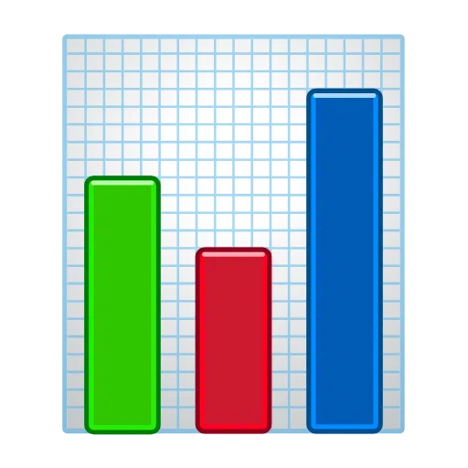

<h3 align="center">

</h3>

##  About Me

- Learning **Machine Learning** and **Deep Learning** through hands-on projects and experimentation
- Exploring areas like **NLP**, **Computer Vision**, and **Neural Networks** at my own pace
- Building small-to-medium projects using **Python** and popular **ML libraries**
- Practicing model training and evaluation using **PyTorch**, **TensorFlow**, and **scikit-learn**
- Building **APIs** with **FastAPI**, **Flask**, and **Django**
- Curious about **LLMs**, **Transformers**, and modern AI system design
- Sharing my learning journey and projects on **[My Portfolio](https://aatansen.github.io)** 

##  This week I spent my time on

<table align="center">
  <tr>
    <td>
      
    </td>
    <td>
      
    </td>
  </tr>
</table>

##  Technical Skills

> [!NOTE]
> *Tools and technologies I actively use or am currently learning. Skill depth varies and improves over time.*

<table align="center">
  <tr>
    <th>
 ML/AI Frameworks
</th>
    <th>
 Programming Languages
</th>
  </tr>
  <tr>
    <td>
      

        
        
        
        
        
      

    </td>
    <td>
      

        
        
        
        
        
      

    </td>
  </tr>

  <tr>
    <th>
 Data Science & Analytics
</th>
    <th>
 API & Backend Frameworks
</th>
  </tr>
  <tr>
    <td>
      

        
        
        
        
        
      

    </td>
    <td>
      

        
        
        
      

    </td>
  </tr>

  <tr>
    <th>
 LLM APIs & AI Tools
</th>
    <th>
 MLOps & Deployment
</th>
  </tr>
  <tr>
    <td>
      

        
        
        
      

    </td>
    <td>
      

        
        
        
        
        
      

    </td>
  </tr>

  <tr>
    <th>
 Cloud & Infrastructure
</th>
    <th>
 Databases
</th>
  </tr>
  <tr>
    <td>
      

        
        
        
        
      

    </td>
    <td>
      

        
        
        
        
      

    </td>
  </tr>

  <tr>
    <th colspan="2">
 Development Tools
</th>
  </tr>
  <tr>
    <td colspan="2">
      

        
        
        
        
        
      

    </td>
  </tr>
</table>

##  My Github Stats

    

<table>
  <tr>
    <td style="padding: 5px;"></td>
    <td style="padding: 10px;"></td>
  </tr>
  <tr>
    <td colspan="2" style="padding: 5px;"></td>
  </tr>
</table>

##  Top Contributed Repo

##  Achievement

  

##  Connect with me

<i>Random dev joke</i> 

